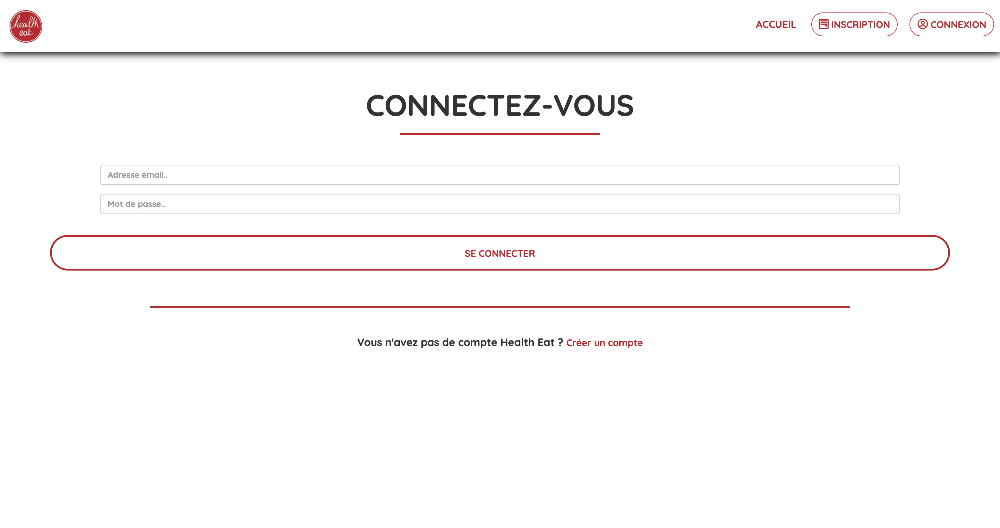
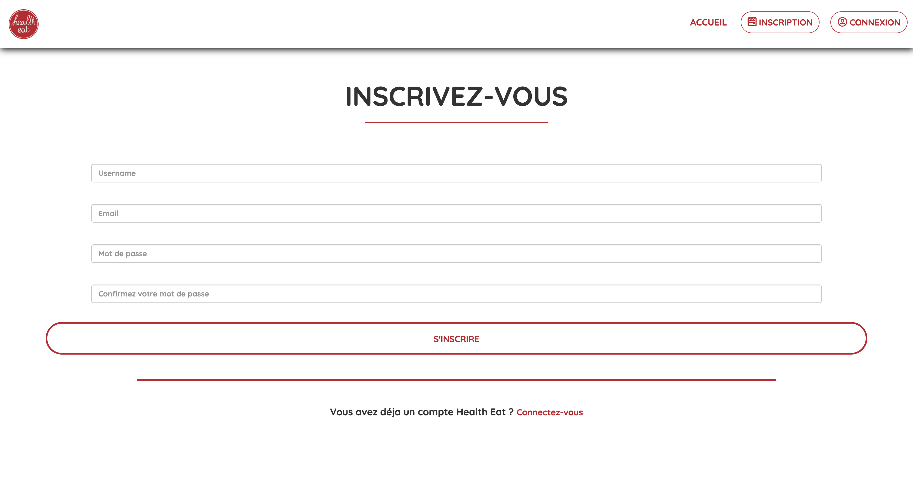
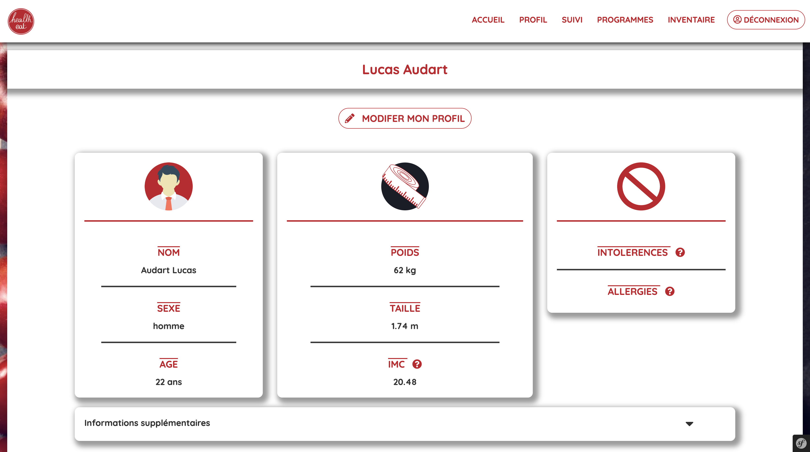
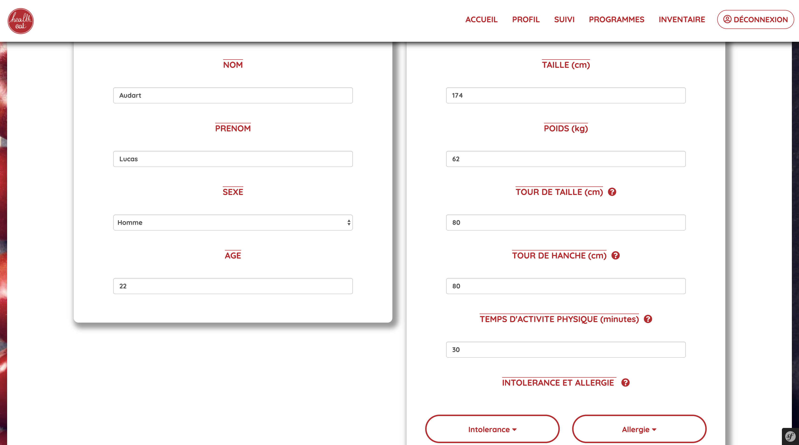
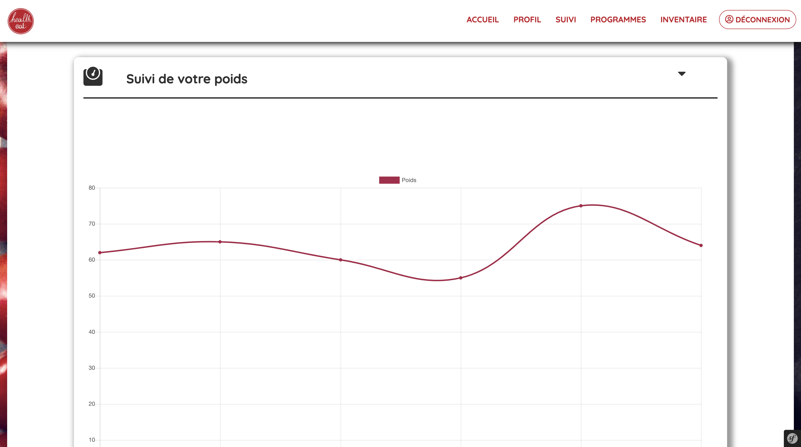
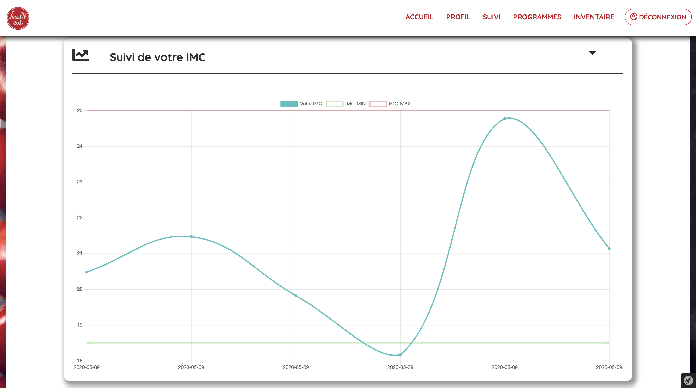
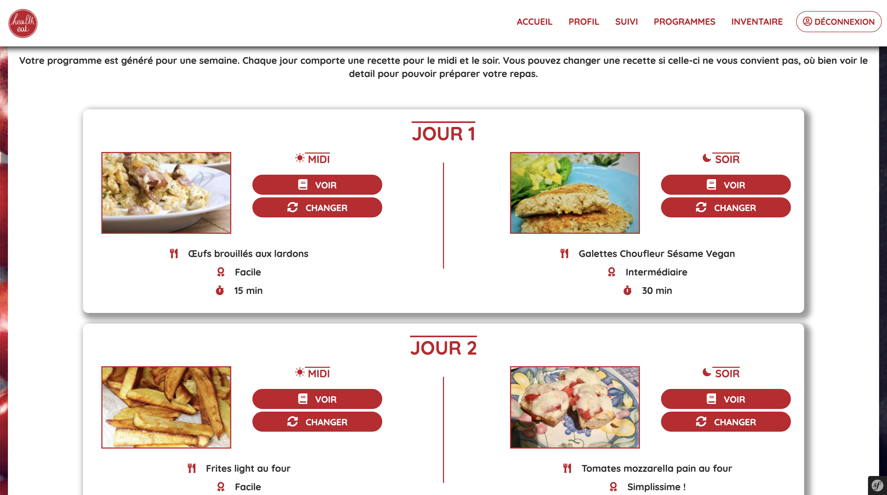
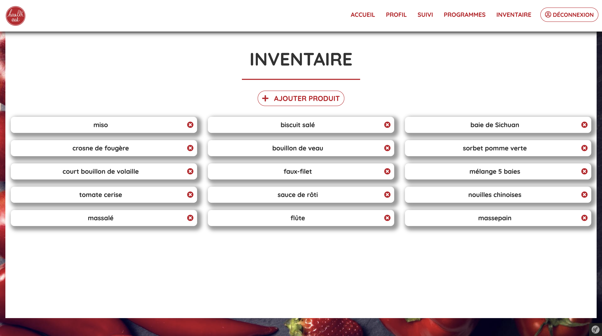

# Healtheat

Healteat est un diététicien en ligne, permettant aux utilisateurs de générer des programmes alimentaires en fonction de leurs informations personnelles.

Le site permet, après avoir rentré ses informations personnelles, de pouvoir suivre différents programmes alimentaires générés automatiquements, et d'avoir l'évolutions de ses différentes informations tel que le poids.

Réalisé dans le cadre de l'UE [LifProjet](http://perso.univ-lyon1.fr/fabien.rico/site/projet:2019:pri:start) dans le cadre de la 3eme année de licence d'informatique à l'université Claude Bernard Lyon 1

## Installation

Si php n'est pas installé :

```bash
sudo apt install php-curl php-gd php-intl php-json php-mbstring php-xml php-zip
```

Si docker n'est pas installé :

```bash
sudo apt install docker-compose
```

Si composer n'est pas installé :

```bash
sudo apt install composer
```
Ou voir la page de [Composer](https://getcomposer.org/download/)

Pour installer le docker contenant notre site web, après avoir git clone : 

```bash
cd apps/my-symfony-app
composer install
```

Pour lancer le site :

```bash
cd ../..
sudo docker-compose up
```

Le site est hebergé sur [localhost](http://localhost:8081) (à ouvrir de préférence avec firefox)

## Organisation du code

### Modèle

Tout le code du modèle ce trouve dans le dossier /src

* On y trouve plusieurs sous dossiers :
    * /Entity pour les entités utilisées notamment pour faire le lien avec la base de donnée
    * /Repository pour les dépot permettant de récupérer dans la base de donnée les informations des entités correspondantes
    * /Migrations pour les migrations qui s'effectue lors de la commande ```php bin/console doctrine:migrations:migrate ```
    * /Form pour les formulaires, dans notre cas le formulaire d'inscription est celui lié aux informations personnelles
    * /Data pour les données provenant du scraping au format csv
    * /Command pour les commandes ajoutées, dans notre cas la commande ```php bin/console csv:import``` qui permet d'importer les fichiers csv dans la base de données

### Controller

Les controllers se trouvent dans le fichier /src/controller.

* On y trouve deux controllers differents :
    * HealtheatController, qui contient toutes les fonctions qui permettent de faire fonctionner le site.
    * SecurityController, qui s'occupe de la partie sécurité de notre site, qui contient la partie connexion / - inscription dans notre cas

### Vue

* Les pages html.twig sont toutes stockées dans le dossier /templates, qui contient plusieurs choses : 
    * Le fichier twig base.html.twig, qui est la base de la vue de notre site
    * Un sous dossier /healtheat qui contient tout les templates du site, affichés en fonction de la vue
    * Un sous dossier /security qui contient les templates de la partie sécurité de notre site


## Explication du code

### Inscription / Connexion



&nbsp;

À la création d'un nouveau compte, un test sur l'adresse mail est effectué pour eviter qu'une même personne créée plusieurs comptes, le mot de passe est crypté avant d'être inseré dans la base de données pour plus de sécurité.

### Module Informations personnelles



&nbsp;

Le formulaire d'informations personnelles est créé par le composant form de symfony, ce qui permet de gagner du temps à la programmation. De plus, le poids et le temps d'activité physique sont aussi stockés dans des tables annexes pour les garder en fonction du temps.

### Module Suivi



&nbsp;

Grâce aux informations stockées dans les tables poids et temps d'activité, on affiche des graphiques avec la librairy javascript Chart.js qui permettent de mieux voir l'évolution du poids au court du temps.

### Module Programme


&nbsp;


Si l'utilisateur n'a pas de programme en cours, un bouton "générer programme" permet, comme son nom l'indique, de générer un programme aléatoirement.
Une fois que l'utilisateur a un programme créé, toutes les recettes du jour courant ainsi que celles des prochains jours sont affichées avec un bouton pour avoir des informations plus détaillés sur la recette et un bouton pour la changer.

### Module Inventaire


&nbsp;

Si l'inventaire de l'utilisateur est vide, un inventaire aléatoire contenant entre 4 et 15 ingredients est généré.
Une fois que l'utilisateur possède un inventaire, il peut ajouter un ingredient aléatoire ou supprimer un ingredient de son choix.